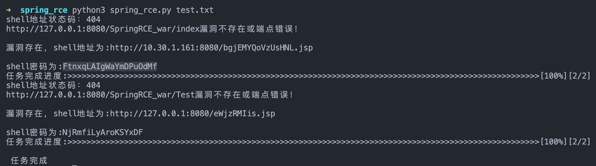
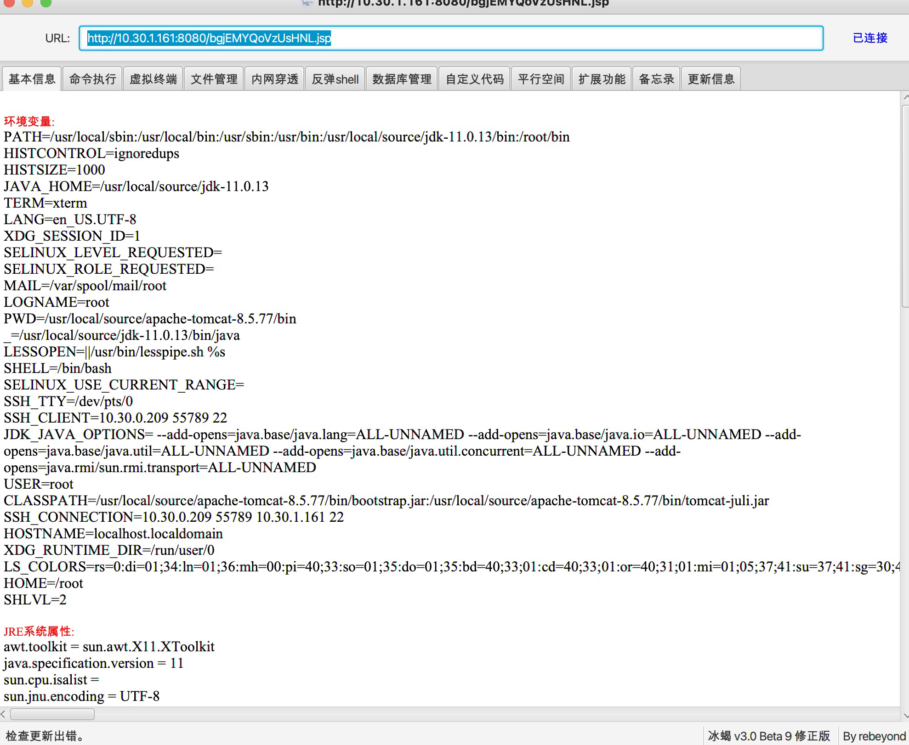

# Spring4shell_behinder

## 这是什么?

一个针对spring4shell漏洞(CVE-2022-22965)的批量快速利用工具

## 贡献者

[4nth0ny](https://github.com/4nth0ny1130) @星期五实验室

欢迎提issues/pr

:)

## 环境

*   python 3.x
*   Behinder3.0 Beta9

## 安装

```
python3 -m pip install -r requirements.txt
```

## 用法

```
python3 spring_rce.py test.txt
```

test.txt

```
http://127.0.0.1:8080/
http://127.0.0.2:8080/
http://127.0.0.3:8080/
```

如需指定参数绑定的路由，请修改第128行，自行添加进列表，脚本会自动拼接端点至每一个URL中尝试


## 例子

本工具会根据目标数量自动分配合理的线程，并将结果打印至终端

### 

使用冰蝎3.0 beta9连接：



## 免责声明

本工具仅能在取得足够合法授权的企业安全建设中使用，在使用本工具过程中，您应确保自己所有行为符合当地的法律法规。 如您在使用本工具的过程中存在任何非法行为，您将自行承担所有后果，本工具所有开发者和所有贡献者不承担任何法律及连带责任。 除非您已充分阅读、完全理解并接受本协议所有条款，否则，请您不要安装并使用本工具。 您的使用行为或者您以其他任何明示或者默示方式表示接受本协议的，即视为您已阅读并同意本协议的约束。
